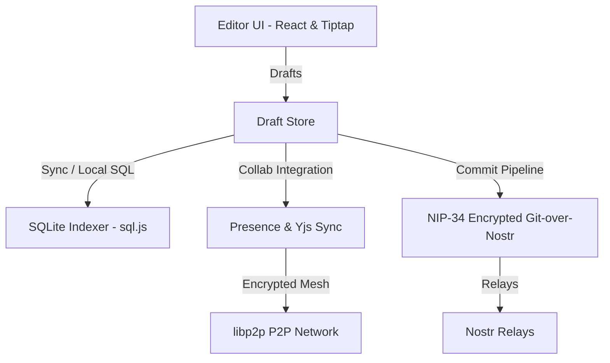

# grid34 📄⚡

A decentralized, local-first workspace combining a Notion-like block editor with **NIP-34 Git-over-Nostr** persistence, backed by an ephemeral P2P mesh for encrypted real-time collaboration.

---

## 🏗️ Architecture

Grid34 is structured into three distinct subsystems that run entirely inside the client browser:



### 1. Storage & Persistence Layer (`src/storage/`)
Models workspace content as an encrypted repository stored natively on Nostr using **NIP-34 Git-over-Nostr** events, and mirrors it locally into a fast SQLite query engine.
* **CEK Encryption (`src/storage/crypto/`)**: Content Encryption Key management ensuring privacy. Only page collaborators can decrypt block contents.
* **Reducer & Commits (`src/storage/repo/` & `src/storage/commit/`)**: Standard Git-like patch reduction. Modified blocks stage drafts, compile commit event templates, and publish signed events to relays.
* **SQLite Engine (`src/storage/index/`)**: Leverages `sql.js` to index the raw repo contents locally for efficient querying.

### 2. Block Editor UI (`src/editor/`)
A modular React editor built with Tiptap/ProseMirror that handles standard document blocks.
* **Rich Text Blocks (`src/editor/blocks/`)**: Supports Paragraph, Heading, and Native nested list items (bullet/numbered lists) initialized inside a single database block for seamless inline editing.
* **Notion-Style Database Blocks (`src/editor/components/` & `src/editor/stores/dbViewStore.ts`)**: Structured grids backed by reactive SQL index queries. You can filter, order, and query database items using query states.
* **Draft Pipeline (`src/editor/stores/draftStore.ts`)**: Intermediary stage layer ensuring edits are continuously staged, debounced, and checkpointed locally before publishing to Nostr.
* **Slash Commands (`/`)**: Inline menu for creating database blocks, headers, and bulleted/numbered lists.

### 3. Collaboration & Peer-to-Peer Sync (`src/collab/`)
Maintains live collaborative editing sessions with zero centralized servers.
* **Encrypted Discovery (`src/collab/discovery/`)**: Uses Nostr NIP-44 encrypted events to advertise peer metadata and coordinate encryption endpoints.
* **Gossipsub Room Management (`src/collab/room/`)**: live pub/sub room join and leave dynamics backed by custom `libp2p` transport layers.
* **Yjs Sync Integration (`src/collab/doc/` & `src/collab/integration/`)**: Coordinates concurrent Yjs doc states and cursor presence directly into the React editor.

---

## ✨ Key Features

* **Local-First & Offline Ready**: All revisions are staged locally and indexed via an embedded browser SQLite database (`sql.js`).
* **Nostr Identity Integrations**: Standard NIP-07 Nostr login (e.g., Alby, nos2x) with contacts sync for page collaborator invites.
* **Decentralized Persistence**: Serverless storage using Git-style commit patches broadcasted via Nostr relays.
* **Live Multi-User Collaboration**: Fully encrypted peer-to-peer workspace sharing, editing, and live cursor awareness.
* **Responsive Dark/Light Mode**: Full CSS-variable-based theme toggling with custom overrides for syntax trees, databases, modals, and login screens.
* **Stately Visual Design**: Clean borders, typography, status badges, and logo aesthetics.

---

## 🛠️ Tech Stack

* **Vite + React + TypeScript** - Fast-bundling runtime environment.
* **Tailwind CSS** - Core utility classes.
* **Tiptap / ProseMirror** - Collaborative Rich Text Block formatting.
* **Yjs + libp2p** - Real-time state replication & P2P networking.
* **applesauce** - Nostr subscription and load orchestration helpers.
* **sql.js** - Browser-compiled SQLite index.

---

## 💻 Commands

Installs dependencies:
```bash
npm install
```

Starts the Vite local development server:
```bash
npm run dev
```

Builds the application for production:
```bash
npm run build
```

Runs the test suite (Vitest):
```bash
npm test
```

Runs specific matching tests:
```bash
npm test -- <pattern>
```

Runs tests in watch mode:
```bash
npm run test:watch
```
